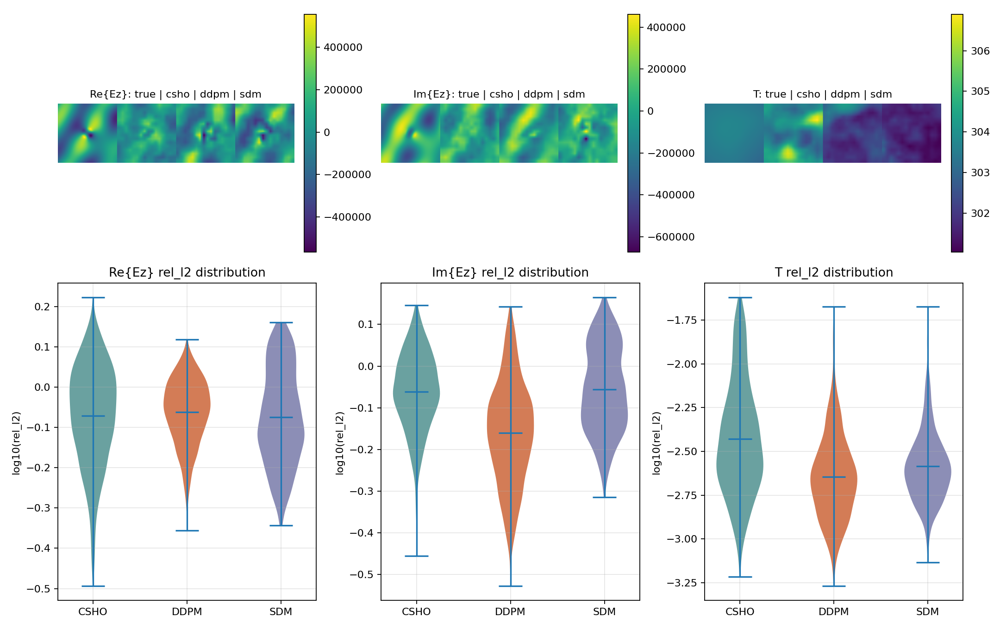

# Coupled Critically Damped Langevin Dynamics for Learning Joint Distributions

## Abstract

Denoising diffusion probabilistic models (DDPMs) and score-based generative models (SGMs) work by
learning to reverse additive noise or the underlying distribution of the data, respectively. They
have both exhibited outstanding synthesis quality across a variety of tasks. In this work, we
investigate the ability of these frameworks to capture cross interactions in domains that require
modeling coupled evolution. To this end, we introduce the coupled critically damped Langevin
dynamics (CCLD) framework for facilitating information exchange whilst improving sampling
efficiency and joint-distribution recovery. We demonstrate our framework's ability to significantly
reduce KL divergence and improve correlation when modeling $N$-body coupled Ornstein--Uhlenbeck
processes, while reducing PDE residuals in coupled multiphysics fields. Thus, our framework
produces new insights into inducing cross interaction biases through the stochastic dynamics rather
than refining model architectures.

## Results


*Step-count sweep across $N=2,3,4,5$ coupled populations with 10 seeds per point and error bars
spanning 1 standard deviation across seeds. Both metrics shown against varying diffusion steps.
**Top row**: Log-log graph of KL divergence to the true stationary Gaussian. **Bottom row**:
Recovered pairwise correlation as a percentage of the true value. The dashed line represents
$100\%$.*



*TE\_heat field reconstruction, single seed. **Top**: true field alongside each method's
reconstruction for $\mathrm{Re}\{E_z\}$, $\mathrm{Im}\{E_z\}$, and $T$. **Bottom**: per-sample
$\log_{10}(\text{rel.\ }\ell_2)$ distribution for each method. Quantitative results are summarized
in the table in Experiments below.*

## Experiments

### Coupled Ornstein-Uhlenbeck processes

For our first task, we evaluate CCLD against DDPM and SGM to capture the joint distributions of
coupled Ornstein-Uhlenbeck (OU) processes. A standard 1-dimensional Ornstein-Uhlenbeck process is a
stochastic process with a mean-reverting force. Here, we consider $N$-dimensional OU processes for
$N$ coupled random variables, represented as

$$d\mathbf{X}_t = -\mathbf{\Theta} \mathbf{X}_t\,dt + \mathbf{D}\,d\mathbf{W}_t,$$

where $\mathbf{X}_t$ is an N-dimensional random variable with $\mathbf{\Theta}$ the $N\times N$
coupling matrix, and $\mathbf{D}$ the diffusion matrix. For CCLD, we keep the coupling constants
$K_{\mathrm{self}}$, $K_{\mathrm{global}}$ fixed at $1.0$. The ground-truth coupling matrix is
constructed such that stability is guaranteed for all seeds using a coupling strength parameter
that reflects the true correlation across populations. In practice we set the coupling strength to
0.6. Following this construction, this task aims to reproduce the stationary distribution of each
process. To this end, we train a small MLP as the score network with an Euler-Maruyama sampler
across the CCLD, DDPM, and SGM formulations. The results of the experiment can be seen in the
step-count sweep figure above. We assess significance with a paired Wilcoxon signed-rank test
across the 10 seeds at each $(N,n)$ combination where the minimum attainable two-sided $p$-value at
$n=10$ is $1/2^9\approx0.00195$.

CCLD attains significantly lower KL divergence than DDPM at every $N$ for $n\le32$ with $p\le0.006$,
and reaching the floor at $n=8,16$. However, this advantage is no longer significant at $n=64,128$
for most $N$, indicating DDPM converges to comparable quality given enough steps rather than CCLD
being uniformly better. Against SGM, CCLD recovers pairwise correlation significantly closer to the
ground truth at the majority of $(N,n)$ combinations for $n\ge32$ with $p<0.05$ and frequently
hitting the floor. This coincides with SGM consistently over-estimating the true correlation by
5--13\% independent of step count. Interestingly, SGM's raw KL divergence is significantly lower
than CCLD's at every $N$ with $p\le0.02$ at the smallest budget of $n=8$. This indicates the
step-efficiency advantage observed against DDPM does not extend to SGM in the same regime. These
results are limited to a single coupling strength 0.6, mean-field coupling only, and $N\le5$. Thus,
future work aims to test whether the same pattern holds under heterogeneous coupling and larger
$N$.

### Coupled PDE field reconstruction

For our second task, we evaluate CCLD against DDPM and SGM on the electro-thermal multiphysics
benchmark that couples a complex electric field $E_z=\mathrm{Re}\{E_z\}+i\,\mathrm{Im}\{E_z\}$ to a
real temperature field $T$ over a $128\times128$ spatial domain, conditioned on material and
geometry. Unlike deterministic PDE surrogates such as physics-informed neural networks or Fourier
neural operators, which learn a single point estimate of the field, our generative formulation
targets the full conditional distribution over coupled fields. We represent each population's state
as a compact latent produced by a shared encoder per seed such that CCLD, DDPM, and SGM all diffuse
over this representation rather than the raw field. The benchmark results can be seen in the table
below. CCLD achieves the lowest electric-field PDE residual of the three methods. This indicates
the most physically self-consistent reconstruction, but not the lowest pointwise error. For that
task, DDPM is noticeably more accurate on $\mathrm{Im}\{E_z\}$ and $T$, yet all three are within
0.01 of each other on $\mathrm{Re}\{E_z\}$. This is a single seed, so no significance test is
possible and these numbers should be read as point estimates rather than a settled comparison. It
is important to note that since all three methods diffuse the shared encoder's latent rather than
the raw field, their achievable accuracy on this task is bounded by that encoder's quality. Since
this bound is identical across methods, it does not favor any one of them. However, it does mean
this experiment measures each method's ability to preserve and refine a shared estimate under
corruption rather than to generate the field from scratch, distinguishing it from the OU task.

**TE\_heat field reconstruction, single seed. Lower is better for all metrics; best value per row
in bold.**

| Metric | CCLD | DDPM | SGM |
|---|---|---|---|
| Re$\{E_z\}$ rel.\ $\ell_2$ | 0.8845 | 0.8811 | **0.8747** |
| Im$\{E_z\}$ rel.\ $\ell_2$ | 0.8875 | **0.7197** | 0.9035 |
| $T$ rel.\ $\ell_2$ | 0.0050 | **0.0027** | 0.0030 |
| $E$-field PDE residual | **85.58** | 91.83 | 88.57 |
| Heat PDE residual | 1.588 | 1.584 | **1.583** |

## Setup

### Install

```
conda create -n coupledsho python=3.10
conda activate coupledsho
pip install -e .
```

### Coupled Ornstein-Uhlenbeck processes

10 seeds, 10,000 training iterations, 40,000 evaluation samples, swept over
$n\in\{8,16,32,64,128\}$ diffusion steps, at $N=2,3,4,5$ coupled populations:

```
bash run_stepcount_sweep.sh 10 10000 40000
```

This runs `run_final_synthetic_experiments.sh` (CCLD, DDPM, and SGM at $N=2,3,4,5$) once per step
count, then aggregates the combined comparison to
`results/experiment_3_synthetic/stepcount_sweep_seeds10_iters10000/`. The step-count sweep figure
above is produced from that aggregate via:

```
python -m synthetic.make_stepcount_figures
```

### Coupled PDE field reconstruction

First, download the electro-thermal (`TE_heat`) split of the Multiphysics-Bench benchmark:

```
python -m pde.download_multiphysics_bench --out-dir pde/multiphysics-bench
```

`pde/multiphysics-bench` is the default data root every script below assumes; export
`PDE_DATA_ROOT=/wherever/you/downloaded/it` instead if you'd rather keep the data elsewhere.

Single seed, 200 epochs, batch size 1024, learning rate $10^{-2}$, 32 diffusion steps:

```
for METHOD in ccld ddpm sdm; do
  python -m pde.run_experiment \
    --config pde/config.yaml --data-root pde/multiphysics-bench --problem TE_heat \
    --method ${METHOD} --seeds 0 --n-epochs 200 --batch-size 1024 --lr 1e-2 \
    --n-diff-steps 32 --out-dir results/experiment_2_physics/TE_heat_comparison
done
```

For the full sweep across 10 seeds, run: `bash run_pde_baselines.sh`.

## Future Work
We are currently focusing on implementing asymmetric coupling to induce stronger biases in the forward dynamics, as well as designing more efficient sampling methods to reduce discretization errors arising from the score term.